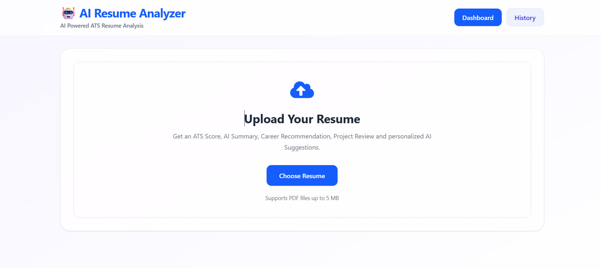
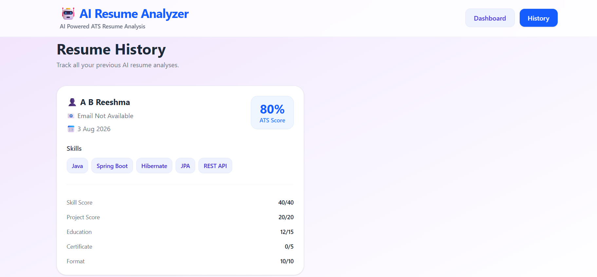

# 🤖 AI Resume Analyzer

An AI-powered Resume Analyzer that evaluates resumes using ATS scoring, skill detection, AI-generated insights, and career recommendations.

---

## 📌 Overview

AI Resume Analyzer is a full-stack web application that analyzes PDF resumes using a combination of rule-based ATS scoring and Google Gemini AI. It helps users understand how ATS-friendly their resumes are while providing intelligent feedback to improve resume quality.

The application extracts resume content, calculates an ATS score, identifies technical skills, generates AI-powered summaries and suggestions, reviews projects, recommends suitable career roles, and stores previous analyses for future reference.

---

## ✨ Features

- 📄 Upload PDF resumes
- 📊 ATS Score calculation
- 💻 Automatic skill extraction
- 🤖 AI-generated professional summary
- 💡 Personalized AI suggestions
- ⭐ AI-powered project review
- 🎯 Career recommendations
- 🕒 Resume analysis history
- 📱 Responsive modern UI

---

## 🛠️ Tech Stack

### Frontend
- React
- Tailwind CSS
- Axios

### Backend
- Java
- Spring Boot
- Spring Data JPA
- REST API

### Database
- MySQL

### AI
- Google Gemini API

### Tools
- Maven
- Git
- GitHub
- IntelliJ IDEA
- VS Code
- Postman

---

## 📸 Screenshots

### Dashboard

> Add your Dashboard screenshot here



---

### Resume History

> Add your History page screenshot here



---

## ⚙️ How It Works

1. Upload a PDF resume.
2. Resume text is extracted from the uploaded file.
3. ATS score is calculated using predefined skill weights and scoring rules.
4. Google Gemini AI generates:
   - AI Summary
   - Resume Improvement Suggestions
   - Project Review
   - Career Recommendations
5. Analysis results are displayed on the dashboard.
6. Resume analysis history is stored in MySQL.

---

## 📂 Project Structure

```
AI-Resume-Analyzer
│
├── frontend (React + Tailwind CSS)
│
├── backend (Spring Boot)
│
├── database (MySQL)
│
└── README.md
```

---

## 🚀 Installation

### Clone Repository

```bash
git clone https://github.com/ABReeshma/AI-Resume-Analyzer.git
```

### Backend

```bash
cd backend

mvn spring-boot:run
```

### Frontend

```bash
cd frontend

npm install

npm run dev
```

---

## 🔌 API Endpoints

| Method | Endpoint | Description |
|---------|----------|-------------|
| POST | `/analyze` | Analyze uploaded resume |
| GET | `/analysis/history` | Get resume analysis history |

---

## 🎯 Future Enhancements

- PDF report download
- Job Description (JD) matching
- Authentication & user accounts
- Resume comparison
- Cloud deployment with Docker
- Advanced ATS analytics

---

## 👩‍💻 Author

**A B Reeshma**

Computer Science Engineering Student

GitHub: https://github.com/ABReeshma

LinkedIn: https://www.linkedin.com/in/reeshma-ab-094907321/

---

## ⭐ If you found this project helpful, consider giving it a star!
